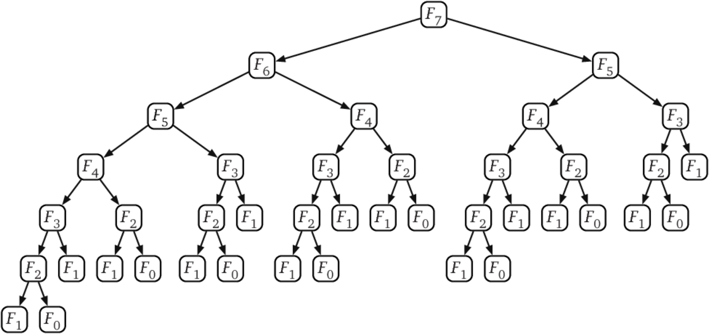

# 동적 계획법 (Dynamic Programming)

## 1. 정의
- 동적계획법 (DP 라고 많이 부름)
    - 입력 크기가 작은 부분 문제들을 해결한 후, 해당 부분 문제의 해를 활용해서, 보다 큰 크기의 부분 문제를 해결, 최종적으로 전체 문제를 해결하는 알고리즘
    - 상향식 접근법으로, 가장 최하위 해답을 구한 후, 이를 저장하고, 해당 결과값을 이용해서 상위 문제를 풀어가는 방식
    - Memoization 기법을 사용함
        - Memoization (메모이제이션) 이란: 프로그램 실행 시 이전에 계산한 값을 저장하여, 다시 계산하지 않도록 하여 전체 실행 속도를 빠르게 하는 기술
    - 문제를 잘게 쪼갤 때, 부분 문제는 중복되어, 재활용됨
        - 예: 피보나치 수열
## 2. 특징
- 문제를 잘게 쪼개서, 가장 작은 단위로 분할
- 부분 문제는 중복되기때문에 상위 문제 해결 시 재활용 됨

## 3. DP 사용 이유
사실 일반적인 재귀(Naive Recursion) 방식 또한 DP와 매우 유사
큰 차이점은 **일반적인 재귀를 단순히 사용 시 동일한 작은 문제들이 여러 번 반복 되어 비효율적인 계산**될 수 있음

피보나치 수열 구현 할 때 재귀함수를 사용하여 쉽게 구현 할수 있음
```java
public class Fibonacci {

    public int getFibonacci(int input) {
        if (input <= 1) {
            return input;
        } else {
            return getFibonacci(input - 1) + getFibonacci(input - 2);
        }
    }

    public static void main(String[] args) {
        Fibonacci fibonacci = new Fibonacci();

        System.out.println(fibonacci.getFibonacci(10));
    }
}
```
그런데 f(n-1), f(n-2)에서 각 함수를 1번씩 호출하면 동일한 값을 2번씩 구하게 되고 이로 인해 100번째 피보나치 수를 구하기 위해 호출되는 함수의 횟수는 기하급수 적으로 증가함. 왜냐하면, f(n-1)에서 한 번 구한 값을 f(n-2)에서 또 다시 같은 값을 구하는 과정을 반복하게 되기 때문이다. 아래의 그림처럼 반복되는 계산을 또 하게 된다.


그러나 한 번 구한 작은 문제의 결과 값을 저장해두고 재사용 한다면 앞에서 계산된 값을 다시 반복할 필요가 없이 약 200회 내에 계산이 가능해짐
즉, 매우 효율적으로 문제를 해결할 수 있게 된다. 시간복잡도를 기준으로 아래와 같이 개선이 가능하다.
>O(n^2) → O(f(n)) 로 개선 (다항식 수준으로, 문제에 따라 다름.)

