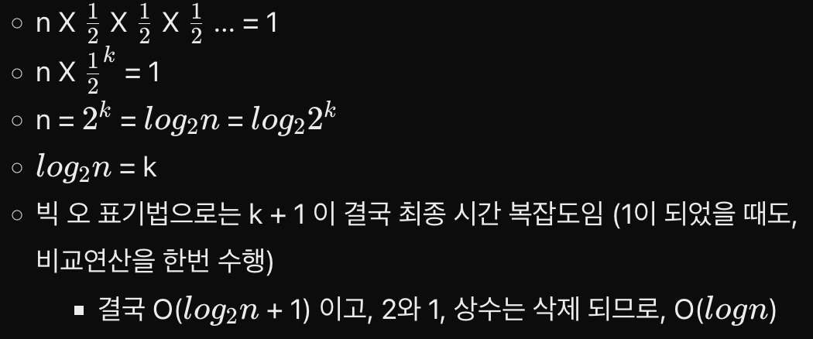

# 탐색 알고리즘
## 2. 이진탐색(Binary Search)
### 1. 순차 탐색 이란?
* 탐색할 자료를 둘로 나누어 해당 데이터가 있을만한 곳을 탐색하는 방법
  
> 출처 : 이미지 내

### 2. 분할 정복 알고리즘의 이진 탐색
- 분할 정복 알고리즘 (Divide and Conquer)
  1. 문제를 하나 또는 둘 이상으로 나눈다.
  2. 나눠진 문제가 충분히 작고, 해결이 가능하다면 해결하고, 그렇지 않다면 다시 나눈다.
- 이진 탐색 구햔
  1. 리스트를 두 개의 서브 리스트로 나눈다.
  2. 검색할 숫자 searchItem > 중간값 이면, 뒷 부분의 서브 리스트에서 검색한다.
  3. 검색할 숫자 searchItem < 중간값 이면, 앞 부분의 서브 리스트에서 검색한다.

### 3. 알고리즘 분석
* n개의 리스트를 매번 2로 나누어 1이 될 때까지 비교연산을 k회 진행
