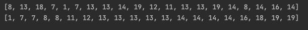

# 대표적인 정렬1: 버블 정렬 (Bubble sort) 

## 1. 정렬 (sorting) 이란?
- 정렬 (sorting): 데이터들이 랜덤으로 주어졌을 때 이를 정해진 순서대로 나열하는 것
- 다양한 알고리즘이 고안되었으며, 알고리즘 학습의 필수

> 다양한 정렬 알고리즘 이해를 통해, 동일한 문제에 대해 다양한 알고리즘이 고안될 수 있음을 이해하고,
> 각 알고리즘간 성능 비교를 통해, 알고리즘 성능 분석에 대해서도 이해할 수 있음

## 2. 버블 정렬 (bubble sort) 란?
- 두 인접한 데이터를 비교해서, 앞에 있는 데이터가 뒤에 있는 데이터보다 크면, 자리를 바꾸는 정렬 알고리즘

#### 애니메이션으로 쉽게 이해하기: https://visualgo.net/en/sorting

> 출처: https://blog.kakaocdn.net/dn/bUriug/btq090GyQBk/YU1pmyrtM6gypU0kvrQ3dk/img.gif

* 데이터가 네 개 일때 (데이터 갯수에 따라 복잡도가 떨어지는 것은 아니므로, 네 개로 바로 로직을 이해해보자.)
    - 예: dataList = [1, 9, 3, 2]
        - 1차 로직 적용
            - 1 와 9 비교, 자리바꿈없음 [1, 9, 3, 2]
            - 9 와 3 비교, 자리바꿈 [1, 3, 9, 2]
            - 9 와 2 비교, 자리바꿈 [1, 3, 2, 9]
        - 2차 로직 적용 
            - 1 와 3 비교, 자리바꿈없음 [1, 3, 2, 9]
            - 3 과 2 비교, 자리바꿈 [1, 2, 3, 9]
            - 3 와 9 비교, 자리바꿈없음 [1, 2, 3, 9]
        - 3차 로직 적용
            - 1 과 2 비교, 자리바꿈없음 [1, 2, 3, 9]
            - 2 과 3 비교, 자리바꿈없음 [1, 2, 3, 9]
            - 3 과 9 비교, 자리바꿈없음 [1, 2, 3, 9]
## 3. 알고리즘 구현
* **특징 찾기**
    - n개의 리스트가 있는 경우 최대 n-1번의 로직을 적용한다.
    - 로직을 1번 적용할 때마다 가장 큰 숫자가 뒤에서부터 1개씩 결정된다.
    - 로직이 경우에 따라 일찍 끝날 수도 있다. 
      - 로직을 적용할 때 한 번도 데이터가 교환된 적이 없다면 이미 정렬된 상태이므로 더 이상 로직을 반복 적용할 필요가 없다.
## 4. 결과

      